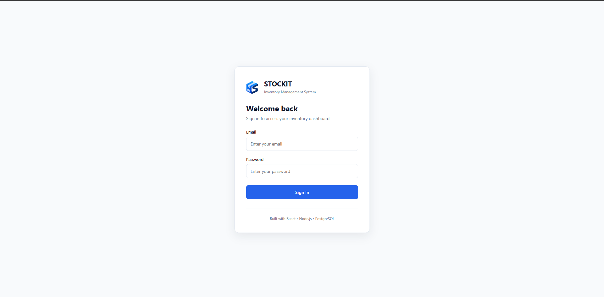
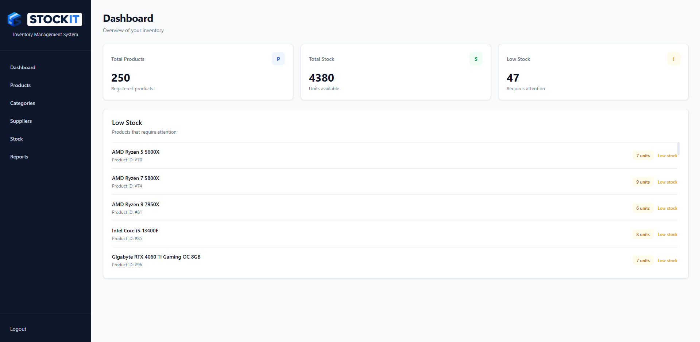
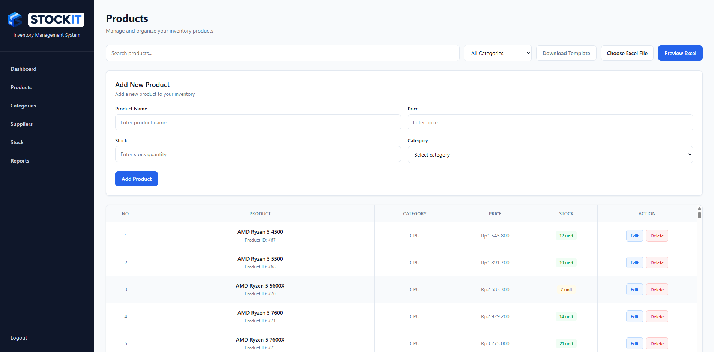
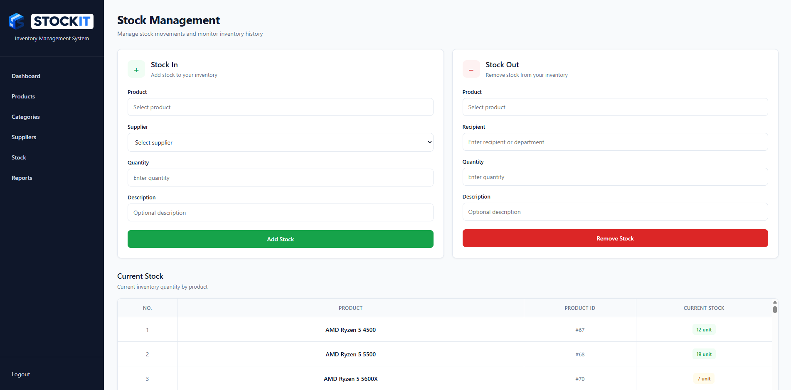
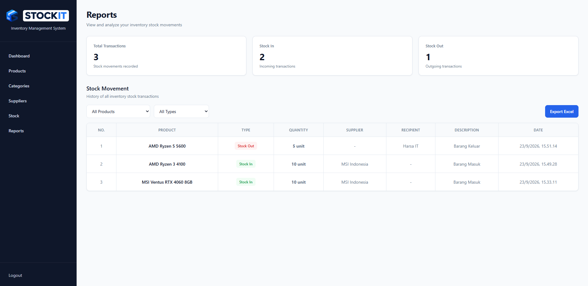

# Stockit — Inventory Management System

Stockit is a web-based inventory management system designed to help warehouse administrators manage products, categories, suppliers, stock movements, and inventory reports in one application.

## Features

- Product, category, and supplier management
- Stock In and Stock Out transactions
- Inventory dashboard and low-stock alerts
- Product search and filtering
- Excel product import with preview and validation
- Stock movement reports
- Excel report export
- JWT authentication
- Role-based access control
- Responsive user interface

## Tech Stack

- **React** — Frontend user interface
- **JavaScript** — Main programming language
- **Node.js & Express.js** — Backend and REST API
- **PostgreSQL** — Relational database
- **JWT** — User authentication
- **SheetJS (XLSX)** — Excel import and export
- **Git & GitHub** — Version control

## Database

Stockit uses PostgreSQL with the following main tables:

- Users
- Categories
- Products
- Suppliers
- Stock Transactions

## Structure Folder

## Project Structure

```text
Stockit/
├── public/
├── src/
│   ├── assets/
│   ├── backend/
│   │   ├── config/
│   │   │   └── database.js
│   │   ├── package.json
│   │   ├── package-lock.json
│   │   └── server.js
│   ├── components/
│   │   └── ProductCard.jsx
│   ├── pages/
│   │   ├── Categories.jsx
│   │   ├── Dashboard.jsx
│   │   ├── Login.jsx
│   │   ├── Products.jsx
│   │   ├── Reports.jsx
│   │   ├── Stock.jsx
│   │   └── Suppliers.jsx
│   ├── App.css
│   ├── App.jsx
│   ├── index.css
│   └── main.jsx
├── screenshots/
│   ├── login.png
│   ├── dashboard.png
│   ├── products.png
│   ├── stock.png
│   └── reports.png
├── .gitignore
├── eslint.config.js
├── index.html
├── package.json
├── README.md
└── vite.config.js
```

## Installation

### 1. Clone the repository

```bash
git clone https://github.com/harsarcv/devproject.git
cd devproject
```

### 2. Install frontend dependencies

```bash
npm install
```

### 3. Install backend dependencies

```bash
cd src/backend
npm install
```

### 4. Configure PostgreSQL

Create a PostgreSQL database and configure the database connection in:

```text
src/backend/config/database.js
```

### 5. Run the backend

```bash
node server.js
```

### 6. Run the frontend

Open another terminal and run:

```bash
cd ../../
npm run dev
```

Open the local URL provided by Vite in your browser.

## Demo Account

```text
Email: admin@stockit.test
Password: Admin123!
```

## Screenshots

### Login



### Dashboard



### Products



### Stock



### Reports



## API

Stockit uses a REST API built with Node.js and Express.js.

### Authentication

- `POST /login`

### Products

- `GET /products`
- `POST /products`
- `PUT /products/:id`
- `DELETE /products/:id`
- `POST /products/import`

### Categories

- `GET /categories`
- `POST /categories`
- `PUT /categories/:id`
- `DELETE /categories/:id`

### Suppliers

- `GET /suppliers`
- `POST /suppliers`
- `PUT /suppliers/:id`
- `DELETE /suppliers/:id`

### Stock

- `POST /stock/in`
- `POST /stock/out`
- `GET /stock/history`

## Author

**Harsa Archive**

Full-Stack Developer | PostgreSQL & Database | Web, Mobile & 3D

GitHub: https://github.com/harsarcv